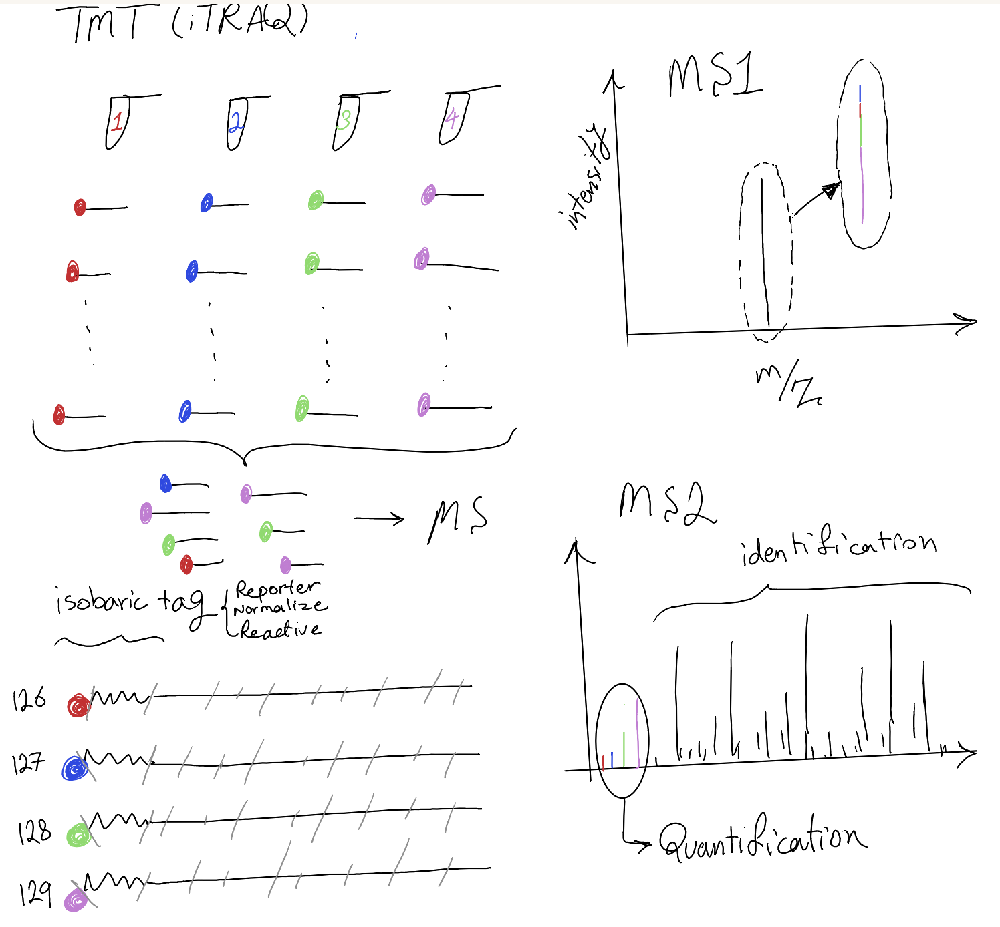
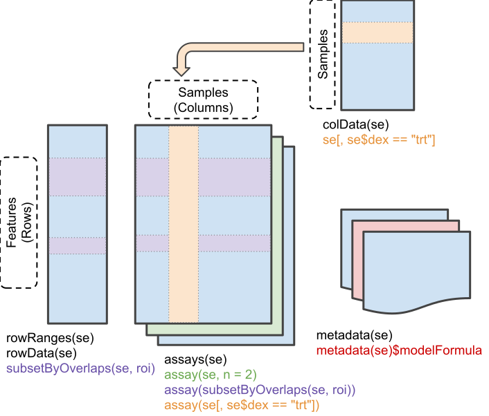
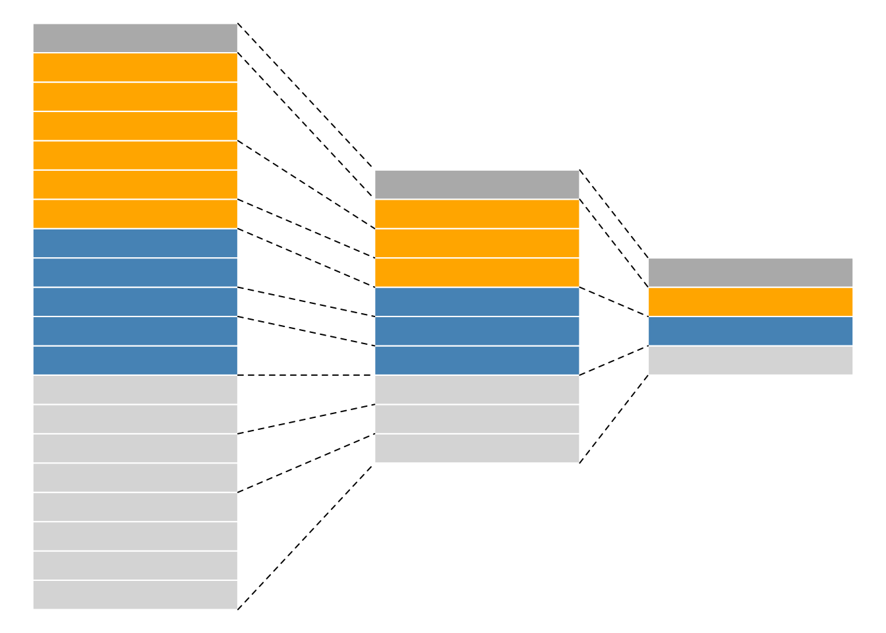
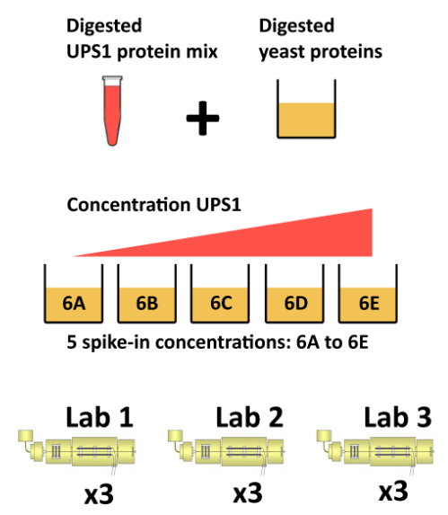

### Quiz 1 (IA_5)

Visit `gosocrative.com` and enter room name `FIN2026`

## Library
```{r, eval=FALSE}
library(rpx)
library(msdata)
library(rpx)
library(Spectra)
library(tidyverse)
library(cleaver)
library(MSnbase)
library(SpectraVis)
library(tidyverse)
library(mzR)
library(PSMatch)
library(pheatmap)
library(QFeatures)
library(sageR)
library(SummarizedExperiment)
library(factoextra)
```

## Preprocessing


```{r, eval=FALSE}
table(id$spectrumID)
table(table(id$spectrumID))
table(id$spectrumID == "controllerType=0 controllerNumber=1 scan=1774")
(i <- which(id$spectrumID == "controllerType=0 controllerNumber=1 scan=1774"))

id[i, ] |>
    as.data.frame() |>
    DT::datatable()

# If the goal is to keep all the matches, but arranged by scan/spectrum:
(id2 <- reducePSMs(id, id$spectrumID))

table(table(id2$spectrumID))

```

### Filtering

```{r, eval=FALSE}
idtbl <- as_tibble(id)

## - Remove decoy hits

idtbl <- idtbl |>
    filter(!isDecoy)

## - Keep first rank matches

idtbl <- idtbl |>
    filter(rank == 1)

idtbl
```

### Removing shared peptides

```{r, results='show', eval=FALSE}
## Ex3- Start by identifying scans that match different proteins. For example scan 4884 matches proteins XXX_ECA3406 and ECA3415. Scan 4099 match XXX_ECA4416_1, XXX_ECA4416_2 and XXX_ECA4416_3. Then remove the scans that match any of these proteins.
dplyr::count(idtbl, spectrumID)

dplyr::count(idtbl, spectrumID) |> 
  filter(n >1)

(mltm <- dplyr::count(idtbl, spectrumID) |> 
  filter(n > 1) |> 
  pull(spectrumID)) # pull() is similar to $. It's mostly useful because it looks a little nicer in pipes

(idtbl <- idtbl |>
    filter(!spectrumID %in% mltm))

idf <- filterPSMs(id)

idf <- id |>
    filterPsmDecoy() |>
    filterPsmRank()
idf
```

## Combining spectral data with ID results

```{r, eval=FALSE}
library(Spectra)

sp <- Spectra(f)
spectraVariables(sp)

head(sp$spectrumId)
length(sp)
table(msLevel(sp))

idf <- filterPSMs(id)
names(idf)

head(idf$spectrumID)
table(table(idf$spectrumID))
which(table(idf$spectrumID) == 4)

idf[idf$spectrumID == "controllerType=0 controllerNumber=1 scan=5490", ] |>
    as.data.frame() 

(idf <- reducePSMs(idf, idf$spectrumID))
```

```{r, eval=FALSE}
spid <- joinSpectraData(sp, idf,
                        by.x = "spectrumId", # in spectra file
                        by.y = "spectrumID") # in identification file

spectraVariables(spid)

# Consider we match peptide sequence for MS2 scans
all(is.na(filterMsLevel(spid, 1L)$sequence)) # No sequence match for MS1 level
table(is.na(filterMsLevel(spid, 2L)$sequence)) # Some of MS2 level can match to a sequence
```

## Visualise MS2 scans

```{r, eval=FALSE}

plotSpectra(spid[1234]); grid()

# What is the exceptional spectra with high score and well annotated when you consider b and y ions
i <- which(spid$MS.GF.RawScore > 100)[1]
plotSpectra(spid[i]); grid()

spid[i]$sequence
calculateFragments("THSQEEMQHMQR")
mz(spid[i])[[1]]

(pdi <- data.frame(peaksData(spid[i])[[1]]))
pdi$label <- addFragments(spid[i])
pdi
plotSpectra(spid[i], labels = addFragments,
            labelCol = "steelblue",
            labelPos = 3); grid()
```

Non-identified peaks in fragment spectra:

- Background noise, low intensity 

- High intensity in the left part of the spectra might relate to TMT molecules 

- High intensity of un-fragmented precursor ion 

- etc.

```{r, eval=FALSE}
## to check what is the effect of filtering intensity on b and y ion that we may miss
filter(pdi,
       !is.na(label)) |>
    arrange(intensity)

spid[i] |>
    filterIntensity(500) |> # check 500 and 100
    plotSpectra(labels = addFragments,
                labelCol = "steelblue",
                labelPos = 3); grid()
```

```{r, eval=FALSE}

spid <- countIdentifications(spid)
spectraVariables(spid) # to check if `countIdentifications` was added

# To see the number of identification based on MS levels
table(msLevel(spid))
table(msLevel(spid),
      spid$countIdentifications)
# now focus on MS1 scans
spid |>
    filterMsLevel(1) |>
    spectraData() |>
    as_tibble() |> # To start using ggplot for visualization
    ggplot(aes(x = rtime,
               y = totIonCurrent)) +
    geom_line() +
    geom_point(aes(colour =
                       ifelse(countIdentifications == 0, # Each dot represent MS1 scan
                              NA, countIdentifications)),
               size = 2) +
    labs(colour = "Number of ids")
```
### Quiz 2 (GA_7)

Visit `gosocrative.com` and enter room name `FIN2026`

## Quantitative proteomics

|     | Label-free         | Labelled              |
|-----|--------------------|-----------------------|
| MS1 | XIC (Decimal)      | SILAC, 15N (Decimal)  |
| MS2 | Counting (integer) | TMT (iTRAQ) (Decimal) |

All quantification in Omics technology is relative quantitative not absolute.

-   Counting: How many PSMs for each protein
-   XIC (Extracted Ion Chromatogram): Intensity of each specific peptide (m/z, precursor) over time (e.g., MaxQuant, XCMS)
-   Labelled TMT benefit: Good to remove technical variability since it would be shared


### Quantitative assay

What we need to quantify? (First level)

-   quantitative data: matrix [features x samples]
-   PSM, protein or peptide level
-   samples/columns annotation (meta-data)
-   features/rows annotation (meta-data)



SummarizedExperiment object

-   quantitative data: assay()
-   samples/columns annotation: colData()
-   features/rows annotation: rowData() Multiple SummarizedExperiment (PSM, peptides, proteins, ...) are combined into a QFeatures object.

Second level is aggregating low-level QF into higher level QF data. We can start with QF file and after quantification, you find an interesting protein and you see only one peptide was used to identify that protein and then only one PSM was related to that peptide, then checking the quality of that PSM would be important.


## Toy QFeatures object
```{r}
library("QFeatures")
data(feat1)
feat1
(se <- feat1[[1]])
feat1[["psms"]]
assay(se)
rowData(se)
colData(se)
colData(feat1) #QF object
colData(feat1)$X <- c("X1", "X2")
feat1$Y <- c("Y1", "Y2")
colData(feat1)
```

```{r}
rowData(feat1[[1]])
(feat1 <- aggregateFeatures(
    feat1,
    i = "psms", # what assay
    fcol = "Sequence", # which feature to aggregate
    name = "peptides", # what is the outcome of aggregation
    fun = colMeans # how to calculate into peptide level
))

assay(feat1[[1]])
assay(feat1[[2]])
# Compare what happened after aggregation of data
rowData(feat1[[2]])
rowData(feat1[[1]])
```
If you directly use the output of MaxQuant, PD or sage, you do not need the following BUT you will miss the **smart** filtering of data

```{r}

(feat1 <- aggregateFeatures(
    feat1,
    i = "peptides",
    fcol = "Protein",
    name = "proteins",
    fun = colMeans
))

# Smart way of filtering while you keep the relationships
feat1["ProtA", , ]
filterFeatures(feat1, ~ pval < 0.05)
filterFeatures(feat1, ~ pval < 0.05, keep = TRUE)

## As an exercise, filter rows of proteins that localize to the `mitochondrion`.
filterFeatures(feat1, ~ location == "Mitochondrion")
```

### Creating QFeatures objects

```{r}
# `QFeatures` object remembers the relation between`SummerizedExperiment` object
## data generated by PD similar to any csv output of third-party software
data(hlpsms)
class(hlpsms)
head(hlpsms)

(hl <- readQFeatures(hlpsms,
                    ecol = 1:10,
                    name = "psms")
)
assay(hl[[1]])
rowData(hl[[1]])
colData(hl)

colData(hl)$group <- rep(c("CTRL", "COND"),
                         each = 5)
colData(hl)
```

```{r}
# An alternative way
(se <- readSummarizedExperiment(hlpsms,
                               ecol = 1:10)
)

colData(se)
QFeatures(list(psms = se))
```

### Quiz 3 (GA_8)

Visit `gosocrative.com` and enter room name `FIN2026`

## Pipeline
### CPTAC


```{r}
## tab-delimited file generated by MaxQuant
basename(f <- msdata::quant(full.names = TRUE))

## Read these data in as either a SummarizedExperiment (or a QFeatures) object.
read.delim(f) |>
  data.frame() |> 
  head()
   
names(read.delim(f))
i <- 56:61
#i <- grep("Intensity\\.", names(read.delim(f)))

(cptac_se <- readSummarizedExperiment(f,
                                     ecol = i,
                                     fname = "Sequence",
                                     sep = "\t")
)
colData(cptac_se)
## Contaminant database/fasta: CRAP, you can downlaod it
```

```{r}
colnames(cptac_se) <- sub("I.+\\.", "", colnames(cptac_se))
colnames(cptac_se)
colData(cptac_se)$condition <- rep(c("6A", "6B"), each = 3)
colData(cptac_se)$id <- rep(7:9, 2)
names(rowData(cptac_se))

keep_vars <- c("Sequence", "Proteins", "Leading.razor.protein",
               "PEP", "Score", "Reverse", "Potential.contaminant")

rowData(cptac_se) <- rowData(cptac_se)[, keep_vars]
```

### Missing values

Missing values (MVs) are **unavoidable** in mass spectrometry (MS) data due to the complexity of proteomics experiments. Many software tools automatically replace MVs with zeros by default, but this is **not recommended**. 

**Best practice:** Use `NA` values instead of zeros. Zeros could represent true absence (technical artifact) or actual low abundance, making it impossible to distinguish **MAR** (Missing At Random) from **MNAR** (Missing Not At Random) mechanisms. After proper imputation, zeros may reappear, but you preserve the original information for downstream analysis.

#### Common MAR Causes in MS Data:

- **DDA-specific:** Precursor ions never selected for fragmentation
- **Ion competition:** Low-abundance peptides suppressed by co-eluting high-abundance ions  
- **Ionization failure:** Peptides that don't ionize well under ESI conditions
- **Identification issues:** False negatives due to poor spectral quality

#### Key Quality Factors Affecting Detection:

1. **Precursor purity** in MS1 (interference from co-eluting ions)
2. **Fragment count** (higher = better identification confidence)  
3. **Fragment intensity** (signal strength impacts quantification)
4. **Fragment series coverage** (b/y ions); presence of precursor peak in MS/MS is suboptimal but tolerable—prefer more right-side ions (y-ions) over left-side (b-ions) when precursor is present

> **Pro tip:** Always document your MV handling strategy as it significantly impacts differential analysis and statistical power.


```{r, eval=FALSE}
assay(cptac_se)
anyNA(assay(cptac_se))

cptac_se <- zeroIsNA(cptac_se)
assay(cptac_se)
nNA(cptac_se)

dim(cptac_se)
barplot(nNA(cptac_se)$nNAcols$nNA)
# you should not see any obvious outliers in samples
```

```{r}
table(nNA(cptac_se)$nNArows$nNA)
# Remember we ignore other files for simplicity of code and the number of NAs could be related to those file.
cptac_se <- filterNA(cptac_se, pNA = 4/6)

table(nNA(cptac_se)$nNArows$nNA)
nNA(cptac_se)
```

### Imputation

Some imputation method good for MAR and some good for MNAR.

```{r, eval=FALSE}
se1 <- impute(cptac_se, method = "knn")
assay(se1)

## Imputation with method "MinDet"
se2 <- impute(cptac_se, method = "MinDet") # impute with the smallest value in each column

## Imputation with method "zero"
se3 <- impute(cptac_se, method = "zero")
```


```{r, eval=FALSE}
#par(mfrow = c(2, 2))

plot(density(na.omit(log2(assay(cptac_se)))))
plot(density(na.omit(log2(assay(se1)))))
plot(density(na.omit(log2(assay(se2)))), title = "MinDet")
plot(density(na.omit(log2(assay(se3)+1))), title = "zero")
```
> Try to understand what is the effect of imputation on the histogram of data, it should be as less as possible.

### Filtering, transformation and normalization

```{r}
cptac <- QFeatures(list(peptides = cptac_se))
colData(cptac) <- colData(cptac[[1]])

cptac

## Using the `filterFeatures()` function, filter out the reverse and contaminant hits, and also retain those that have a posterior error probability smaller than 0.05.
table(rowData(cptac_se)$Reverse)
table(rowData(cptac_se)$Potential.contaminant)

(ctpac <- cptac |>
    filterFeatures(~ Reverse != "+") |>
    filterFeatures(~ Potential.contaminant != "+") |>
    filterFeatures(~ PEP < 0.05))
(cptac <- cptac |>
    logTransform(i = "peptides",
                 name = "log_peptides") |>
    normalize(i = "log_peptides",
              name = "lognorm_peptides",
              method = "center.median"))
```

### Aggregation

```{r}
## log-normalized peptides into proteins, defined the Leading.razor.protein variable.
cptac <-
    aggregateFeatures(cptac,
                      i = "lognorm_peptides",
                      name = "proteins",
                      fcol = "Leading.razor.protein",
                      fun = colMedians,
                      na.rm = TRUE)

table(rowData(cptac[[4]])$.n)

limma::plotDensities(assay(cptac[["peptides"]]))
limma::plotDensities(assay(cptac[["log_peptides"]]))
limma::plotDensities(assay(cptac[["lognorm_peptides"]]))
```

```{r}
library(tidyverse)
# Using QFeature: Highlight the variability at the peptide level, effect of noise and imputation missing values (Very interesting plot)
cptac["P02787ups|TRFE_HUMAN_UPS", ,
      c("lognorm_peptides", "proteins")] |>
    longForm() |>
    as_tibble() |>
    ggplot(aes(x = colname,
               y = value,
               colour = rowname)) +
    geom_point() +
    geom_line(aes(group = rowname)) +
    facet_wrap(~ assay)
```

```{r}
plot(cptac)
normalize(cptac, "log_peptides",
          name = "logquantiles_peptides",
          method = "quantiles") |>
    aggregateFeatures(
        "logquantiles_peptides",
        name = "proteins2",
        fcol = "Leading.razor.protein",
        fun = colMedians,
        na.rm = TRUE) |>
    plot()
```
# Further reading:
https://rformassspectrometry.github.io/book/index.html
